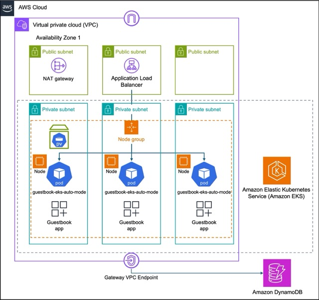

# AWS EKS Auto Mode Terraform demo

This repo provides the terraform files to deploy a demo app running on an AWS EKS Cluster with **Auto Mode** _enabled_, using best practices. This was created as an _educational_ tool to learn about EKS Auto Mode and Terraform. It is _not_ recommended that this configuration be used in production, without further assessment to ensure it meets organization requirements.

To learn more about AWS EKS Auto Mode see the [AWS Documentation](https://docs.aws.amazon.com/eks/latest/userguide/automode.html).

In these Terraform files, comments describe how AWS EKS Auto Mode simplifies and changes deployment. You can search for "_EKS Auto Mode_" to find these comments.

## Deployed resources

This Terraform configuration deploys the following resources:
* AWS EKS Cluster with Auto Mode _enabled_, using Amazon EC2 nodes
* Amazon DynamoDB table
* Amazon Elastic Block Store (EBS) volume used as attached storage for the Kubernetes cluster (a `PersistentVolume`)
* Demo "guestbook" application, deployed via containers
* Application Load Balancer (ALB) to access the app

Plus several other supporting resources, as shown in the following diagram:

## How to use

Run all command from an environment that has
* Terraform installed
* aws cli installed
* AWS credentials to the target account for

### Option 1. For those familiar with using Terraform
1. Update the S3 bucket and DynamoDB table used for Terraform backend state here: [backend.tf](terraform/backend.tf). Instructions are in the comments in that file.
1. Choose one of the `tfvars` configuration files in the [terraform/environment](terraform/environment) directory, or create a new one. The environment name `env_name` should be unique to each `tfvars` configuration file. You can also set the AWS Region in the configuration file.
1. `cd` into the `terraform` directory
1. Run `terraform init`
1. Set the terraform workspace to the same value as the environment name `env_name` for the `tfvars` configuration file you are using.
   * If this is your first time running then use `terraform workspace new <env_name>`
   * On subsequent uses use `terraform workspace select <env_name>`
1. Run `terraform plan -var-file=environment/<selected tfvars file>`, and review the plan
1. Run `terraform apply -var-file=environment/<selected tfvars file>`

Under **Outputs** may be listed a value for `alb_dns_name`. If not, then 
* you can wait a few seconds and re-run the `terraform apply` command, or
* you can look up the value in your EKS cluster by examining the `Ingress` Kubernetes resource

Use this DNS name to access the app.  Use `http:\\` (do _not_ use https). It may take about a minute after initial deployment for the application to start working.

If you want to experiment and make changes to the Terraform, you should be able to start at step 3.

### Option 2. Automatic configuration and execution
Coming soonish

### Tear-down (clean up) all the resources created
See [these steps](docs/cleanup.md#tear-down-clean-up-all-the-resources-created). 

---
I welcome feedback or bug reports (use GitHub issues) and Pull Requests.

[MIT License](LICENSE)